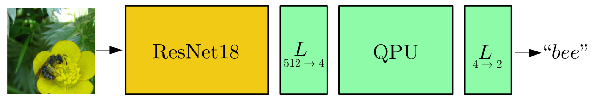

# qnn_visualization
For QISKIT Hackathon Korea

## Authors
* [Joon Suk Huh](https://github.com/JsHHsJ)
* [Dongmin Kim](https://github.com/dmk2436)
* [Yisak Kim](https://github.com/yisakk)

## Visualistic evaluations of quantum neural network layers
Original paper : *"Transfer learning in hybrid classical-quantum neural networks"* [arXiv:1912.08278](https://arxiv.org/abs/1912.08278) (2019).

## Motivations
* The number of literatures on Quantum Machine Learning (QML) is rapidly increasing recently [1].
* Especially, a method of QML called Quantum Neural Network (QNN) has been intensively investigated [2-4].
* However, advantages of QNN are yet to be fully understood both theoretically and empirically.

## Objectives
* We would like to investigate the efficacy of QNNs by using various visual interpretation methods developed for classical Deep Neural Networks (DNN).
* Our model of choice is the Hybrid Quantum-Classical Neutral Network (Hybrid-QCNN) from [4].
* This model uses pre-trained DNN (ResNet18, trained over ImageNet) followed by ‘dressed’ 4-qubit QNN. 
* The authors of [4] trained parameters of ‘dressed’ 4-qubit QNN part over CIFAR-10 dataset (which is different from ImageNet).

## Contents
* `classical_cat_dog.pt` : classical neural network
* `quantum_cat_dog.pt` : neural network w/ quantum fc layer
* `quantum_deep_dream.ipynb` : quantum network deep dream [5]
* `quantum_network_saliency_map.ipynb` : quantum network saliency map [6]
* `t-sne_layer_by_layer.ipynb` : quantum network layer-wise t-sne [7]
* `quantum_loss_landscape.ipynb` : quantum network training loss landscapes [8]

[1] Biamonte, Jacob, et al. "Quantum machine learning." Nature 549.7671 (2017): 195-202.

[2] Jeswal, S. K., and S. Chakraverty. "Recent developments and applications in quantum neural network: a review." Archives of Computational Methods in Engineering 26.4 (2019): 793-807.

[3] Beer, Kerstin, et al. "Training deep quantum neural networks." Nature communications 11.1 (2020): 1-6.

[4] Mari, Andrea, et al. "Transfer learning in hybrid classical-quantum neural networks." Quantum 4 (2020): 340.

[5] Mordvintsev, Alexander; Olah, Christopher; Tyka, Mike (2015). "DeepDream - a code example for visualizing Neural Networks". Google Research. Archived from the original on 2015-07-08.

[6] Simonyan, Karen, Andrea Vedaldi, and Andrew Zisserman. "Deep inside convolutional networks: Visualising image classification models and saliency maps." arXiv preprint arXiv:1312.6034 (2013).

[7] Hinton, Geoffrey, and Sam T. Roweis. "Stochastic neighbor embedding." NIPS. Vol. 15. 2002.

[8] Li, Hao, et al. "Visualizing the loss landscape of neural nets." arXiv preprint arXiv:1712.09913 (2017).
